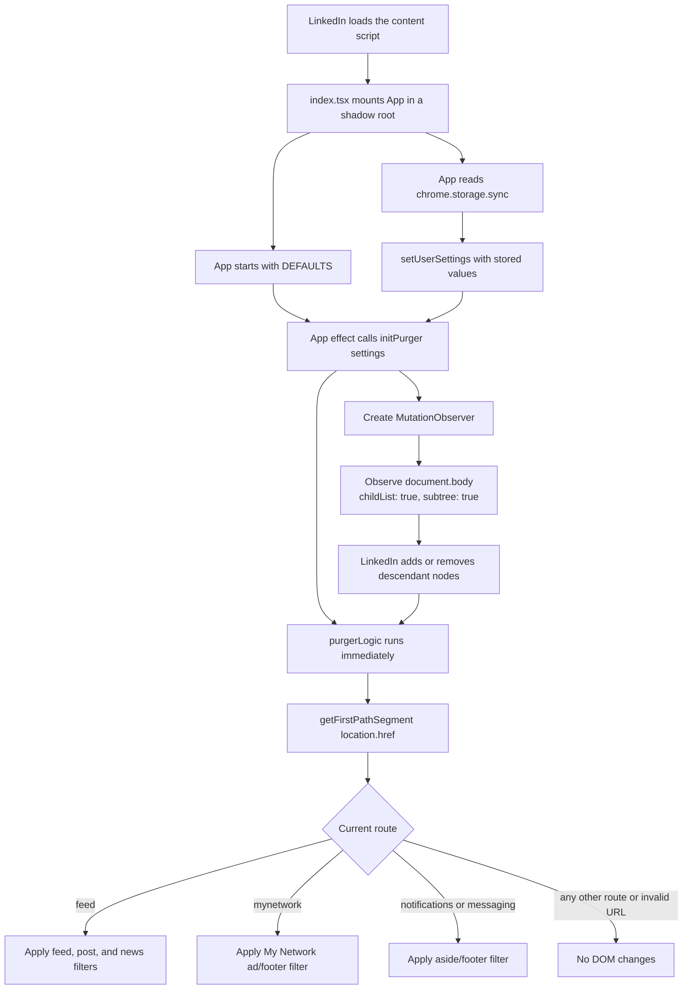
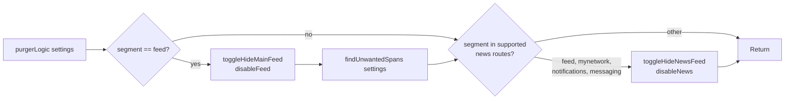
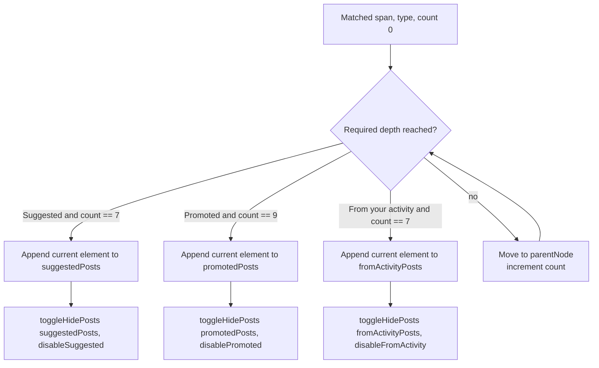
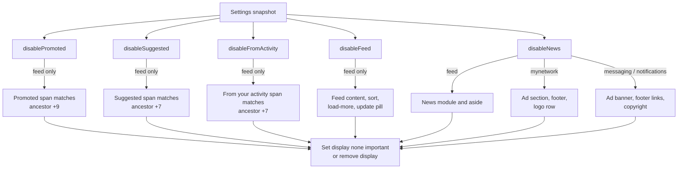

# Filter engine flow

This page maps the current implementation of [`FilterEngine.ts`](../src/services/FilterEngine.ts), from extension startup to each DOM mutation it performs.

## System boundary

The filter engine is a content-script DOM filter. It does not remove nodes, intercept network requests, or rewrite LinkedIn data. It finds selected LinkedIn elements in the current document and either:

- hides them with an inline `display: none !important`; or
- unhides them by removing the inline `display` property.

Its behavior is controlled by five boolean fields from [`Settings`](../src/components/constants.ts):

| Setting | Default | Control-panel switch | Applied on | Effect |
| --- | ---: | --- | --- | --- |
| `disablePromoted` | `true` | `#nnl-promoted` | `/feed` | Hides recorded posts containing a span whose HTML includes `Promoted`. |
| `disableSuggested` | `true` | `#nnl-suggested` | `/feed` | Hides recorded posts containing a span whose HTML includes `Suggested`. |
| `disableFromActivity` | `true` | `#nnl-from-activity` | `/feed` | Hides recorded posts containing a span whose HTML includes `From your activity`. |
| `disableFeed` | `false` | `#nnl-feed` | `/feed` | Hides the main feed and associated feed controls. |
| `disableNews` | `true` | `#nnl-news` | `/feed`, `/mynetwork`, `/notifications`, `/messaging` | Hides route-specific news, advertising, or footer elements. |

Each switch writes its boolean to `chrome.storage.sync`; the storage-driven settings refresh then re-enters the filter flow. The `theme` setting is not consumed by the filter engine.

## Function map

| Function | Called by | Responsibility and side effects |
| --- | --- | --- |
| `initPurger(userSettings)` | `App` settings effect | Runs one filtering pass, creates a `MutationObserver`, and begins observing `document.body`. |
| `purgerLogic(userSettings)` | `initPurger` and its observer callback | Dispatches filtering according to the current first URL path segment. |
| `toggleHideMainFeed(toggle)` | `purgerLogic` on `/feed` | Resolves four feed targets and applies the display rule. |
| `findUnwantedSpans(userSettings)` | `purgerLogic` on `/feed` | Logs that the scan ran, collects all spans once, filters them by label, records presumed post containers, and applies all three post settings. |
| `deleteUnwantedSpans(type, element, count)` | `findUnwantedSpans` | Recursively walks to a fixed ancestor depth and appends the result to a module-level array. Despite its name, it does not delete a node. |
| `toggleHidePosts(posts, toggle)` | `findUnwantedSpans` | Applies the display rule to every non-null entry in the supplied post array. |
| `toggleHideNewsFeed(toggle)` | `purgerLogic` on supported routes | Resolves route-specific news, ad, and footer targets and applies the display rule. |

All functions except `initPurger` are private to the module. None returns a result used by its caller.

## End-to-end flow

### Trigger sequence

1. [`src/index.tsx`](../src/index.tsx) is injected on `https://www.linkedin.com/*` and renders `App`.
2. `App` initializes `userSettings` with `DEFAULTS` and asynchronously reads `chrome.storage.sync`.
3. The `App` effect keyed by `JSON.stringify(userSettings)` calls `initPurger(userSettings)`:
   1. `purgerLogic` runs once immediately.
   2. A `MutationObserver` is attached to `document.body` for descendant child-list changes.
4. When stored settings arrive, or a control-panel switch writes a new setting, the storage listener refreshes `userSettings`. The changed settings object causes `initPurger` to run again.
5. Every registered observer invokes `purgerLogic` after LinkedIn adds or removes nodes anywhere below `document.body`.

The observer watches `childList` changes only. Attribute and text changes by themselves do not trigger a filtering pass.

## Route dispatcher

`purgerLogic` derives the route from the first non-empty URL pathname segment through `getFirstPathSegment(location.href)`.

| First path segment | Main feed | Label-matched posts | News/ad/footer targets |
| --- | ---: | ---: | ---: |
| `feed` | Yes | Yes | LinkedIn News module and News aside |
| `mynetwork` | No | No | Advertisement section, compact footer, and logo row |
| `notifications` | No | No | Ad banner, compact footer links, and copyright |
| `messaging` | No | No | Ad banner, compact footer links, and copyright |
| Any other value or `null` | No | No | No |

## Feed filtering

On `/feed`, operations run in this order:

1. `toggleHideMainFeed(userSettings.disableFeed)`
2. `findUnwantedSpans(userSettings)`
3. `toggleHideNewsFeed(userSettings.disableNews)`

### Main feed and controls

`toggleHideMainFeed` resolves each target independently. Within a row below, selectors are tried left-to-right and the first match is used.

| Target | Selector fallback chain |
| --- | --- |
| Main feed | `div.scaffold-finite-scroll__content[data-finite-scroll-hotkey-context="FEED"]` → `[data-finite-scroll-hotkey-context="FEED"]` → `.scaffold-finite-scroll__content` |
| Sort button | `button.artdeco-dropdown__trigger:has(> hr.feed-index-sort-border)` → closest `button` above `hr.feed-index-sort-border` → `button.artdeco-dropdown__trigger.full-width[aria-expanded][type="button"]` |
| Load-more button | `button.scaffold-finite-scroll__load-button` → `button.artdeco-button.scaffold-finite-scroll__load-button` → `#ember322` |
| New-update pill | `button.feed-new-update-pill__new-update-button` → closest `button` above `div.feed-new-update-pill__loader` → `button.artdeco-button.feed-new-update-pill__new-update-button` |

For each resolved target:

- `disableFeed === true` sets `display: none !important`.
- `disableFeed === false` removes the inline `display` property.
- A missing target is ignored through optional chaining.

### Suggested, promoted, and From your activity posts

`findUnwantedSpans` collects every `span` in the document once, then filters that collection three times:

1. spans whose `innerHTML` contains the case-sensitive string `Suggested`;
2. spans whose `innerHTML` contains the case-sensitive string `Promoted`;
3. spans whose `innerHTML` contains the case-sensitive string `From your activity`.

It writes `findUnwantedSpans() triggered` to the console on every scan. Ancestor-detection and mutation logs are guarded by the module-level `DEV_LOGS = false` flag.

Each matching span is mapped to a presumed post container by `deleteUnwantedSpans`:

The mapping is positional, not selector-based:

| Type | Detection text | Recorded node |
| --- | --- | --- |
| Suggested | `span.innerHTML.includes("Suggested")` | Ancestor seven parent hops above the matching span |
| Promoted | `span.innerHTML.includes("Promoted")` | Ancestor nine parent hops above the matching span |
| From your activity | `span.innerHTML.includes("From your activity")` | Ancestor seven parent hops above the matching span |

After all matches of a type are recorded, `toggleHidePosts` receives that type's module-level array and setting. A `null` entry is skipped; every non-null entry is hidden or unhidden using the common display rule.

## News, ad, and footer filtering

`toggleHideNewsFeed` checks the current route again and resolves route-specific targets. Selector fallbacks are tried left-to-right.

### `/feed`

| Target | Selector fallback chain |
| --- | --- |
| News module | `#feed-news-module.news-module--with-game` → `#feed-news-module` → `.news-module--with-game` |
| News aside | `aside.scaffold-layout__aside[aria-label="LinkedIn News"]` → `aside[aria-label="LinkedIn News"]` |

### `/mynetwork`

| Target | Selector fallback chain |
| --- | --- |
| Advertisement section | closest `section` above `iframe[title="advertisement"][componentkey*="mynetwork"]` → closest `section` above `iframe[title="advertisement"]` → parent of `iframe[title="advertisement"]` |
| Compact footer | closest `footer` above `[data-view-name^="compact-footer-"]` → closest `footer` above `footer [data-view-name^="compact-footer-"]` |
| Footer logo row | closest `div` above `svg#linkedin-logo-xxsmall` → closest `div` above `#linkedin-logo-xxsmall` |

### `/messaging` and `/notifications`

| Target | Selector fallback chain |
| --- | --- |
| Ad/news module | `aside.scaffold-layout__aside section.ad-banner-container` → `aside.scaffold-layout__aside .ad-banner-container` → `section.ad-banner-container` |
| Footer links | `ul.global-footer-compact__links` → `.global-footer-compact__links` |
| Copyright | `#compactfooter-copyright` → `#compactfooter-copyright.global-footer-compact__content` |

For every route, `disableNews === true` hides each found target and `false` removes its inline `display` property. Missing elements are ignored.

## State and lifecycle semantics

### Recorded post state

`promotedPosts`, `suggestedPosts`, and `fromActivityPosts` are module-level arrays:

- They persist for the lifetime of the injected content script.
- A scan appends matches; it does not clear or deduplicate previous entries.
- Detached elements and duplicate references can remain in the arrays.
- Turning a setting off only visits elements already recorded by this module plus matches found during the current scan.

### Observer lifecycle

Each `initPurger` call creates a new `MutationObserver`. The function does not return the observer or a cleanup callback, and the calling React effect has no cleanup. Consequently, settings changes add observers that retain the settings snapshot passed when each observer was created. In React development `StrictMode`, effect replay can add more observers.

This is current implementation behavior, not an intended lifecycle guarantee. On a later DOM mutation, all registered observers may run `purgerLogic` with their respective captured settings.

### SPA navigation

The observer always reads the current `location.href`, so a filtering pass after a DOM mutation uses the current route. Separately, `App` polls the URL every 500 ms and listens for `popstate` and `hashchange`. It reloads the extension only when the first path segment changes and the previous segment was `mynetwork` or `jobs`; this reload behavior is outside `FilterEngine.ts` but can reset its module-level arrays and observers.

## Complete setting-to-DOM map

## Failure and no-op behavior

- An invalid URL makes `getFirstPathSegment` log `Invalid URL provided` and return `null`; the dispatcher then performs no filtering.
- A selector that matches nothing produces `null`; optional chaining makes that target a no-op.
- If the fixed ancestor walk reaches above the document before its target depth, `null` is recorded and later skipped.
- Text matching is case-sensitive and uses `innerHTML`; changed labels, localization, or LinkedIn DOM-depth changes can prevent detection or select the wrong ancestor.
- Unhiding removes `display`; it does not preserve a display value that existed before the engine first overwrote it.
